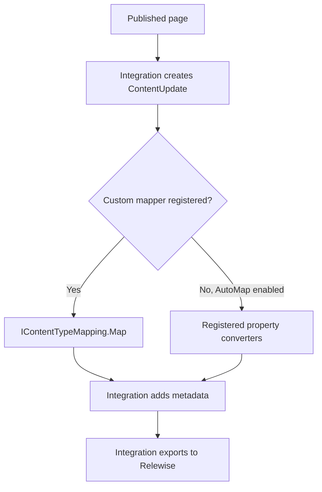

# Custom content mapping

[Documentation home](README.md) · [Block editors](block-editors.md) · [Validation](validation-and-troubleshooting.md)

A content mapper decides which values from one published Umbraco page become Relewise content data. Use it when your export needs editorial rules: extracting text from blocks, combining properties, excluding configuration, or producing a field such as `searchText`.

## Contents

- [Choose an extension point](#choose-an-extension-point)
- [Understand the mapping pipeline](#understand-the-mapping-pipeline)
- [Write a minimal mapper](#write-a-minimal-mapper)
- [Register a mapper](#register-a-mapper)
- [Preserve ordinary property mapping](#preserve-ordinary-property-mapping)
- [Handle cultures](#handle-cultures)
- [When a property converter is appropriate](#when-a-property-converter-is-appropriate)
- [Design the exported data](#design-the-exported-data)

## Choose an extension point

| Requirement | Approach | Scope |
| --- | --- | --- |
| Export supported properties without special rules | `contentType.AutoMap()` | A registered document type |
| Decide what a page contributes, combine fields, or apply site-specific block rules | `contentType.UseMapper(...)` with `IContentTypeMapping` | A registered document type; one mapper can serve several types |
| Teach automatic mapping about a new property editor | `IRelewisePropertyValueConverter` and `services.AddValueConverter<T>()` | Every matching property processed by the converter service |

A **document type alias** selects a mapper. A **property editor alias** selects a property converter. A **property alias** identifies a particular field such as `contentRows`. These are different names with different roles.

`UseMapper(...)` takes over property mapping; it is not a callback after `AutoMap()`. Calling both does not compose the two approaches: the current implementation chooses the custom mapper when one is registered. Reuse the property converter service inside your mapper if you want ordinary fields converted automatically.

Registering a document type without `AutoMap()` or `UseMapper(...)` makes it available for tracking but does not configure its content export. Register the containing page type for blocks; block element types do not become separate exported pages simply because they occur inside it.

## Understand the mapping pipeline



The integration supplies a `ContentMappingContext` with:

| Member | Purpose |
| --- | --- |
| `PublishedContent` | Published values for the page being exported. Work from these instead of raw editor storage JSON. |
| `ContentUpdate` | The update already initialized with content ID, display name, category paths, and the requested update kind. |
| `CulturesToPublish` | The page's published cultures, or the site's default culture for invariant pages. |
| `GetService(...)` / `GetRequiredService<T>()` | Access to registered services. The context implements `IServiceProvider`. |

**Modify and return `context.ContentUpdate`.** Do not construct a replacement update. In the current implementation, the outer mapping operation retains its original update reference. Returning a different instance is not a reliable way to replace the export, and can lose the changes you expected to send.

After mapping, the integration adds these reserved data keys using dictionary `Add`:

- `UmbracoVersionId`
- `contentTypeAlias`
- `url`
- `createdAt`

Do not emit these keys yourself, including through automatically converted properties with colliding aliases. They will cause duplicate-key errors. Use names such as `canonicalUrl` for your own fields.

The mapper does not send a request to Relewise. The export service handles transport and publication lifecycle. Keep extraction independent of HTTP requests, Razor rendering, and the current visitor.

Sources: [mapping pipeline](../src/Integrations.Umbraco/Services/ContentMapper.cs), [context](../src/Integrations.Umbraco/ContentMappingContext.cs), [configuration](../src/Integrations.Umbraco/RelewiseUmbracoConfiguration.cs).

## Write a minimal mapper

This complete class exports an example invariant text property named `summary`. Replace the alias to match your schema. See [cultures](#handle-cultures) before using this minimal example with translated content.

```csharp
using System.Collections.Generic;
using System.Threading;
using System.Threading.Tasks;
using Relewise.Client.DataTypes;
using Relewise.Integrations.Umbraco;

public sealed class SummaryMapper : IContentTypeMapping
{
    public Task<ContentUpdate> Map(ContentMappingContext context, CancellationToken token)
    {
        token.ThrowIfCancellationRequested();
        var culture = context.CulturesToPublish[0];
        var summary = context.PublishedContent.GetProperty("summary")
            ?.GetValue(culture) as string ?? string.Empty;

        context.ContentUpdate.Content.Data = new Dictionary<string, DataValue?>
        {
            ["summary"] = new DataValue(summary)
        };

        return Task.FromResult(context.ContentUpdate);
    }
}
```

Only `summary` and the integration's metadata will be mapped by this example. Existing fields stored remotely are a separate concern; see [update semantics](validation-and-troubleshooting.md#removed-fields-and-update-semantics).

## Register a mapper

For a stateless mapper with no constructor dependencies, register an instance in your existing Umbraco builder:

```csharp
.AddRelewise(options => options
    .AddContentType("article", type => type.UseMapper(new SummaryMapper()))
    .AddContentType("simplePage", type => type.AutoMap()))
```

Use the overload that supplies `IServiceProvider` when your mapper is registered with dependency injection. The complete block example uses this pattern:

```csharp
using Microsoft.Extensions.DependencyInjection;
using Relewise.Integrations.Umbraco;
using Relewise.MappingExamples;

// Before building the application:
builder.Services.AddSingleton<EditorialContentMapper>();

// Within your existing builder.CreateUmbracoBuilder() chain:
.AddRelewise((options, services) =>
{
    var mapper = services.GetRequiredService<EditorialContentMapper>();
    options.AddContentType("article", type => type.UseMapper(mapper));
    options.AddContentType("landingPage", type => type.UseMapper(mapper));
    options.AddContentType("simplePage", type => type.AutoMap());
})
```

The second snippet shows two insertion points, not a standalone `Program.cs`. Keep your existing Relewise client configuration, backoffice, website, and application startup. See the [complete registration instructions](examples/AdvancedContentMapping/README.md#register-in-your-application).

Mapper instances are retained by the integration configuration. Treat them as shared services: keep per-page state in local variables, avoid capturing scoped services, and make dependencies safe to share. Do not store the current page or culture in an instance field. If extraction requires I/O, make it asynchronous and pass the cancellation token through.

## Preserve ordinary property mapping

Resolve `IRelewisePropertyConverter` from the mapping context and give it the properties you want to preserve:

```csharp
// Inside Map; add Microsoft.Extensions.DependencyInjection,
// Relewise.Integrations.Umbraco.Services, and System.Linq imports.
var converter = context.GetRequiredService<IRelewisePropertyConverter>();
var ordinaryProperties = context.PublishedContent.Properties
    .Where(property => property.Alias is "title" or "summary" or "tags");
var data = converter.Convert(ordinaryProperties, context.CulturesToPublish.ToArray())
    .ToDictionary(pair => pair.Key, pair => pair.Value);

// Add your derived fields here, then assign data to context.ContentUpdate.Content.Data.
```

An explicit list is usually easiest to reason about: adding an editor-only field to Umbraco will not silently make it part of the exported data. To preserve a broader existing export, filter out the properties your mapper owns and reserved keys, then convert the rest. Conversion preserves the behavior of **registered converters**, not all possible editor types. An unsupported property can be omitted without an error.

Exclude custom-handled Block Lists before conversion if you want to avoid running the default Block List converter unnecessarily. Keep field ownership clear so two parts of your mapper cannot accidentally produce the same key.

## Handle cultures

Pass a culture explicitly when reading a property: `property.GetValue(culture)`. Do not use the current HTTP request language to drive exports; exports can run outside a visitor request.

For a single language, a `DataValue` containing a string is sufficient. To carry several language versions in one field, use a `Multilingual` value:

```csharp
// textForCulture represents your own extraction function.
var values = context.CulturesToPublish
    .Select(culture => new Multilingual.Value(culture, textForCulture(culture)))
    .ToArray();
data["searchText"] = new DataValue(new Multilingual(values));
```

The ordinary converter service applies its own rules: invariant properties use the first culture; variant strings with several values become `Multilingual`; string lists become `MultilingualCollection`; other variant types can get culture-suffixed keys. See [the implementation](../src/Integrations.Umbraco/Services/RelewisePropertyConverter.cs).

For derived block text, consider the whole composition. An invariant container can contain culture-dependent values or references. The complete example extracts once per published page culture. Decide your fallback rules explicitly, and test a missing translation. It reads published property values directly and does not add a custom fallback policy.

## When a property converter is appropriate

A converter is useful when one editor has the same meaning everywhere it is used. This example supports an illustrative custom editor alias, `Acme.PlainText`; it assumes that editor returns a string:

```csharp
using Relewise.Client.DataTypes;
using Relewise.Integrations.Umbraco;

public sealed class PlainTextPropertyConverter : IRelewisePropertyValueConverter
{
    public bool CanHandle(RelewisePropertyConverterContext context) =>
        context.Property.PropertyType.EditorAlias == "Acme.PlainText";

    public void Convert(RelewisePropertyConverterContext context)
    {
        var text = context.Property.GetValue(context.Culture) as string ?? string.Empty;
        context.Add(context.Property.Alias, new DataValue(text));
    }
}
```

Register it before the service provider is built:

```csharp
builder.Services.AddValueConverter<PlainTextPropertyConverter>();
```

This makes it available to automatic mapping and to custom mappers that call `IRelewisePropertyConverter`.

**All matching converters run.** There is no first-match-wins override rule. `context.Add` uses a dictionary's `Add`, so matching the same editor and writing the same key as an existing converter can throw. Registration order does not make replacement safe. Prefer a content mapper for site-specific changes to built-in Block List behavior; do not remove internal converter classes by their type-name strings.

If a custom converter needs the aggregate `IRelewisePropertyConverter`, constructor-injecting it creates a dependency cycle: the aggregate is constructed from all converters. The built-in nested converters resolve it during conversion through a service provider instead. For page-specific composition, a mapper avoids that converter-level cycle altogether.

## Design the exported data

Choose a stable, intentional schema before writing a recursive walker:

| Example field | Contents | Why |
| --- | --- | --- |
| `title` | Page title | Display and search relevance |
| `summary` | Editorial introduction | Search result excerpt |
| `searchText` | Selected visible text from blocks | Searchable page body |
| `tags` | Editorial tags | Filtering or matching |
| `heroImageUrl` | Resolved media URL | Display; keep separate from prose |

A mapper does not configure search weights, filters, or which fields your search setup searches. Verify those separately in your Relewise setup. Exporting a field and making it influence search are separate steps.

Next: [map Block List and Block Grid](block-editors.md), or open the [complete example](examples/AdvancedContentMapping/README.md).
